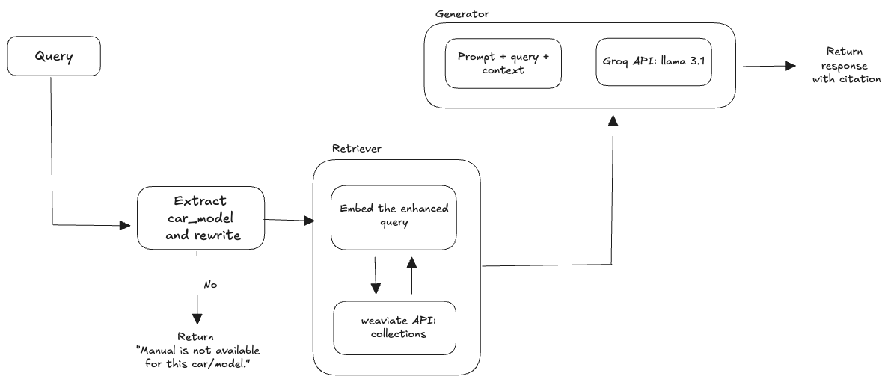
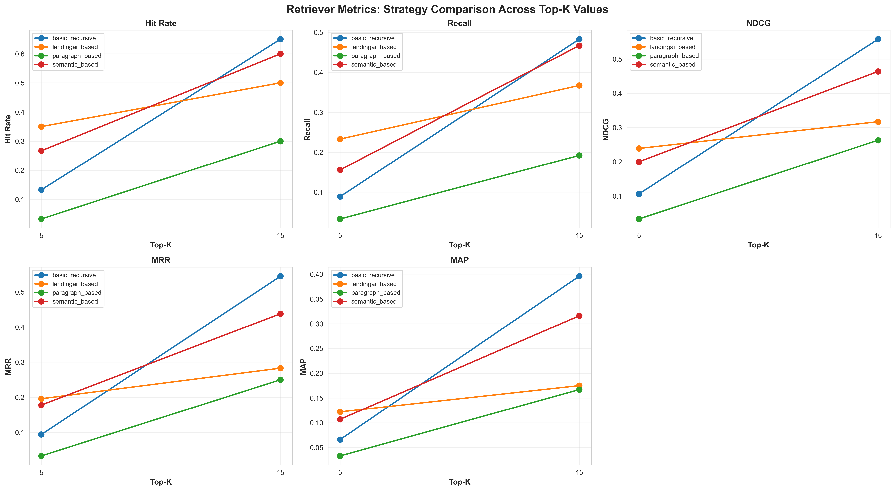
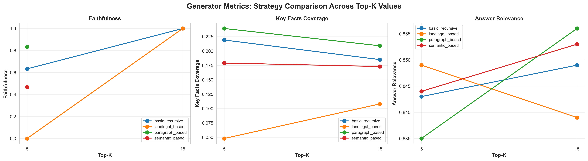

# Car Manual RAG System

## Overview

This application showcases a developer-friendly UI, comprehensive evaluation framework, and tunable parameters for a RAG system with adjustable configurations.

The app demonstrates a near-production setup using Weaviate as a vector database over embedded/in-app databases such as FAISS and ChromaDB.

You can run this application using one of the 4 methods mentioned in , showcasing flexible deployment and shipment options.

This app includes agentic components such as query parser and query rewriter, with a slight trade-off in latency for improved quality.

## Adjustable Parameters

1. **Chunking Strategy**
2. **Top K**
3. **Search Method**

**Default Configuration:** Landing AI parsing strategy with top_k=5 and hybrid search provided the best results across all performance metrics and is set as default.

## Getting Started

Refer to `RUN_INSTRUCTIONS.md` for setup and running instructions.

## Architecture

[View/Edit on Excalidraw](https://excalidraw.com/#json=UPObaBBUPch1Z6KoBUuJQ,halb8Z7RNSu69A8uX4_9WQ)

**Weaviate Database:** Cloud-based vector store enabling scalable, production-grade semantic search with efficient indexing and retrieval.

**Query Parser & Rewriter:** Agentic layer that extracts car model information and enhances queries for better context matching before retrieval.

**Pipeline Flow:** Query → Parse & Rewrite → Embed & Search Weaviate → Retrieve Context → Generate Response via Groq API (Llama 3.1).

## Data Ingestion & Chunking Strategies

- **Basic Recursive:** Simple character-based splitting with fixed chunk size and overlap
- **Semantic-Based:** Embedding similarity-driven chunking with 0.7 threshold for coherent segments
- **Paragraph-Based:** Natural paragraph boundaries as chunk delimiters
- **Landing AI-Based:** API-powered parsing with markdown tables and image descriptions ([Landing AI](https://landing.ai/))

## Evaluation

**Ground Truth Generation:** Created using Claude Sonnet 4.5 from PDF manuals to ensure high-quality evaluation data.

**Results Interpretation:**
- Landing AI demonstrates superior answer relevance at lower top_k values (5), maintaining quality without retrieval overhead
- Paragraph-based strategy shows best answer relevance at top_k=15 but requires more retrieval operations
- Landing AI preserves markdown formatting for tables and includes image descriptions, crucial for technical documentation
- Balancing retrieval efficiency and answer quality, Landing AI at top_k=5 provides optimal performance

**Results:** Complete ground truth data, evaluation scripts, and performance results are available in the `evaluation/` folder.